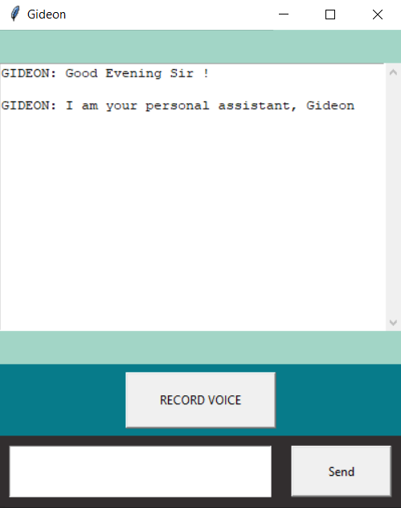

## A Python based Virtual Assistant - Gideon 

This a desktop app built with tkinter which can reply to simple queries from the user.
You can send a message and it will return a response on what it thinks the message is
by comparing it to preset search parameters. 

I tried to make this work locally without needing any wi-fi connection, but
the speech to text recognition of sphinx was inaccurate and so I switched to 
google's recognition API.  

### Gideon's Interface

